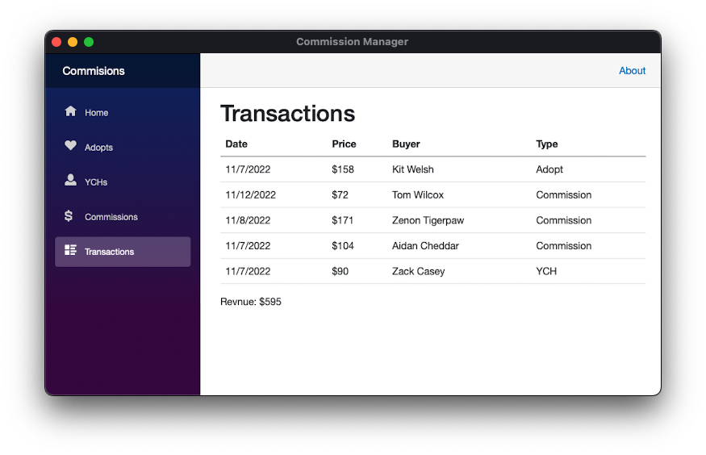

# Commission Manager

Commission Manager is a desktop application keeping track of commission and YCH transactions. The information can later be imported into databases or modified externally from a spreadsheet program.

This is still a major work in progress. Contribution to the project is most welcome.

## Requirements

### Prerequisites

- [.NET](https://dotnet.microsoft.com/download) 7 or later.
- IDEs or Editors
  - [Visual Studio Code](https://code.visualstudio.com/)
  - [Visual Studio 2022](https://visualstudio.microsoft.com/)

## License

I license this project under the Apache 2.0 license - see the [LICENSE](LICENSE) file for details.
